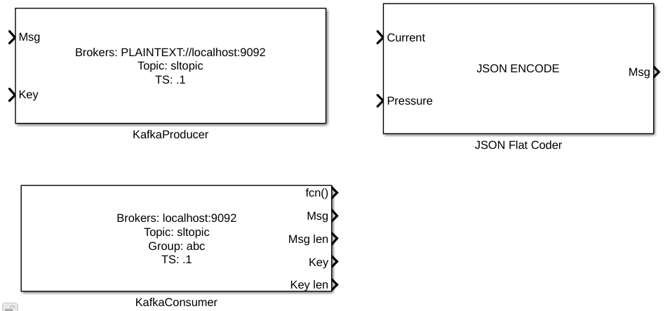
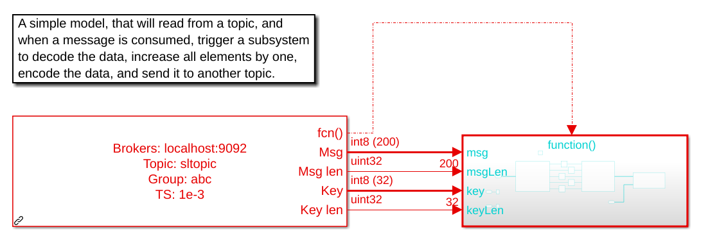
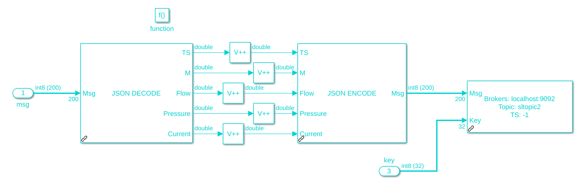
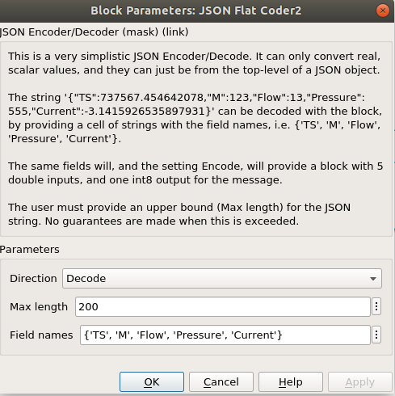
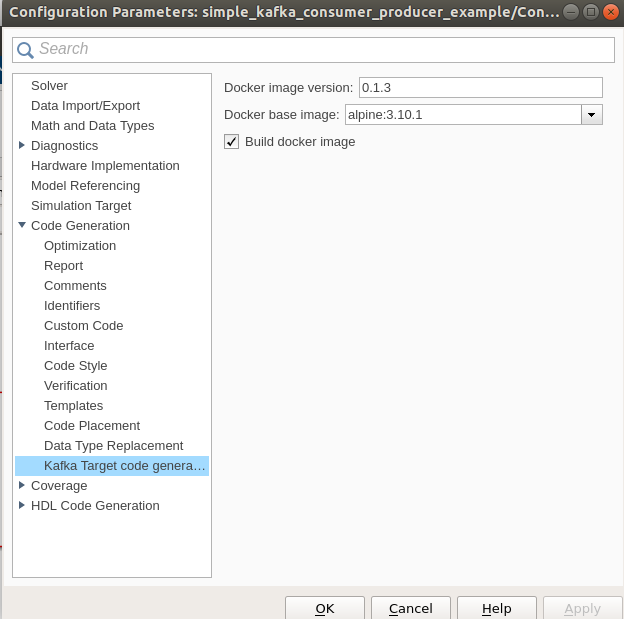

# Basic Usage

## MATLAB Kafka Producer
Using the Kafka producer is straightforward.

```matlab
P = kafka.Producer('<mybroker>', '<mytopic>');
P.publish('mykey', 'my message');
```
The same producer can, and should be used for sending several
messages to the same topic.

The key and message arguments should be in a form that can automatically be converted to ```int8```. A structure can be converted to a bytearray using jsonencode, e.g.

```matlab
>> msg = jsonencode(struct('Temp', 37.0, 'Elev', 214))
msg =
    '{"Temp":37,"Elev":214}'
```

## Simulink clients

For Simulink, there are both producer and consumer blocks, as well as
a simple JSON converter block.



For the Simulink producer, the user must provide a ```broker```(s) string, and a ```topic``` name. The key can be provided as a parameter or used externally (especially useful when passing on a key from a consumer).
It is also necessary to provide a maximum length of the messages that will be sent, which will create suitably sized signal lines in Simulink.

The Simulink consumer, in addition to the ```broker```and ```topic``` parameters, must have a ```group```, ```MsgLen```, ```KeyLen``` and sample time parameter too.

To be noted is that the consumer has a function call output, which will
trigger when a message has been received.

As an example, the following model will try to consume messages from  ```sltopic```.
When a message arrives, it will trigger the connected block.



In the  triggered block the JSON message is simply unpacked, trivially changed, encoded into JSON again and published on a different topic, but with the same key as before.



### Example
Open the model `simple_kafka_consumer_producer_example` that can be found in the `examples`
directory. This model will consume messages from the topic `sltopic`, and produce slightly changed (`+1`, as seen in picture above) messages on `sltopic2`.

The model is set to run infinitely, and uses [Simulink pacing](https://www.mathworks.com/help/simulink/ug/simulation-pacing.html?s_tid=srchtitle), to make it run in near real-time. It is configured to talk to a Kafka broker on `localhost:9092`. Change this, if necessary.

In order to see what is happening, the Apache Kafka command line consumers can be used.

Once the model is started, it needs messages to consume. The messages should be in JSON format
with 5 fields. The function `makeFPCEntry` can be used to create these messages.

First create a Kafka Producer in MATLAB:
```matlab
P = kafka.Producer('localhost:9092', 'sltopic')
```

Send a number of random messages to the Simulink model
```matlab
N=500;
for k=1:N
    P.publish(sprintf('akey_%03d', k), jsonencode(makeFPCEntry(1)));
end
```
The results should be visible in the kafka consumers, and similar to the output below. The format for each line is `key@partition : value`. The topics used here have 10 partitions each.

For `sltopic`
```
akey_495@1 : {"TS":737720.45890374458,"M":284,"Flow":33.337481551942595,"Pressure":47.317087079327173,"Current":5.59765296653597}
akey_496@5 : {"TS":737720.45890374517,"M":284,"Flow":30.783610291649129,"Pressure":49.835437319004519,"Current":6.8494747247336552}
akey_498@0 : {"TS":737720.45890374645,"M":284,"Flow":36.798931378533929,"Pressure":34.4980699941747,"Current":5.2526221249175533}
% Reached end of topic sltopic [1] at offset 1747
akey_497@3 : {"TS":737720.45890374586,"M":284,"Flow":30.567294997661712,"Pressure":37.342567689653166,"Current":4.778624433017189}
% Reached end of topic sltopic [5] at offset 1806
akey_499@6 : {"TS":737720.458903747,"M":284,"Flow":32.465470010496368,"Pressure":30.445383389255223,"Current":5.5686402474026027}
% Reached end of topic sltopic [0] at offset 1813
% Reached end of topic sltopic [3] at offset 1721
akey_500@6 : {"TS":737720.45890374761,"M":284,"Flow":26.766302076811542,"Pressure":35.688570042759665,"Current":5.9482245761980126}
% Reached end of topic sltopic [6] at offset 1707
```

For `sltopic2`
```
akey_495@1 : {"TS":737721.4589037446,"M":285.0000000000,"Flow":34.3374815519,"Pressure":48.3170870793,"Current":6.5976529665}
akey_496@5 : {"TS":737721.4589037452,"M":285.0000000000,"Flow":31.7836102916,"Pressure":50.8354373190,"Current":7.8494747247}
% Reached end of topic sltopic2 [1] at offset 1729
% Reached end of topic sltopic2 [5] at offset 1778
akey_497@3 : {"TS":737721.4589037459,"M":285.0000000000,"Flow":31.5672949977,"Pressure":38.3425676897,"Current":5.7786244330}
akey_498@0 : {"TS":737721.4589037464,"M":285.0000000000,"Flow":37.7989313785,"Pressure":35.4980699942,"Current":6.2526221249}
% Reached end of topic sltopic2 [3] at offset 1716
% Reached end of topic sltopic2 [0] at offset 1811
akey_499@6 : {"TS":737721.4589037470,"M":285.0000000000,"Flow":33.4654700105,"Pressure":31.4453833893,"Current":6.5686402474}
akey_500@6 : {"TS":737721.4589037476,"M":285.0000000000,"Flow":27.7663020768,"Pressure":36.6885700428,"Current":6.9482245762}
% Reached end of topic sltopic2 [6] at offset 1692

```

Code can also be generated from this model, and run as an executable or in dockerized form (see [Embedded Coder Target](#embedded-coder-target) below)

### JSON Encoder/Decoder
The JSON encoder/decoder used here is a simple decoder, that is
assuming that:
* The JSON object is exactly that, an object.
* That it's flat, or to be more precise, only top-level values can be read.
* That all values are numbers, and treated as doubles by Simulink.



## Embedded Coder Target

The `kafkatarget` lets you build code from your model with Kafkablocks, that can be run as a
separate executable. It furthermore generates and builds a Dockerfile, containing the
executable built from the generated code. This Docker image can then be instantiated one or more times using Docker.

**The dockerfile build currently only runs on a Linux host.**

The `kafkatarget` has the following options

* Docker image version - The version the docker images are tagged with
* Docker base image - Here a few options, Ubuntu, Debian and Alpine are present.
* Build docker images - If checked, will start the docker build after code generation has finished.


